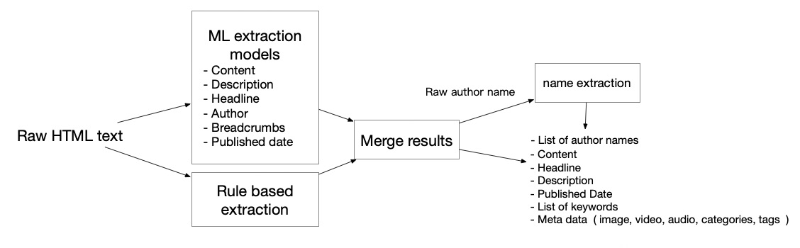
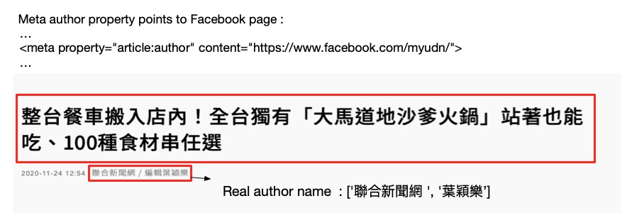

ExtractNet
=======

Based on the popular content extraction package [Dragnet](https://github.com/dragnet-org/dragnet/), ExtractNet extend the machine learning approach to extract other attributes such as date, author and keywords from news article. 





## Why don't just use existing rule-base extraction method:

We discover some webpage doesn't provide the real author name but simply populate the author tag with a default value.

For example [ltn.com.tw](https://news.ltn.com.tw), [udn.com](https://udn.com/news/story/7205/5037493) always populate the same author value for each news article while the real author can only be found within the content.



ExtractNet uses machine learning approach to extract these relevant data through visible section of the webpage just like a human.


## What ExtractNet is and isn't

* ExtractNet is a platform to extract any interesting attributes from any webpage, not just limited to content based article.

* The core of ExtractNet aims to convert unstructured webpage to structured data without relying hand crafted rules

* ExtractNet do not support boilerplate content extraction

<br />

# Performance

Results of the body extraction evaluation:

We use the same body extraction benchmark from [article-extraction-benchmark](https://github.com/scrapinghub/article-extraction-benchmark) 


| Model  | Precision  | Recall  | F1  | Accuracy  |
|---|---|---|---|---|
| AutoExtract |  0.984 ± 0.003 | 0.956 ± 0.010  | 0.970 ± 0.005  | 0.470 ± 0.037   |
| Diffbot  | 0.958 ± 0.009  | 0.944 ± 0.013  | 0.951 ± 0.010  |  0.348 ± 0.035  |
| boilerpipe  | 0.850 ± 0.016  |  0.870 ± 0.020 | 0.860 ± 0.016  | 0.006 ± 0.006   |
| dragnet  |  0.925 ± 0.012 | 0.889 ± 0.018  | 0.907 ± 0.014  | 0.221 ± 0.030   |
| **ExtractNet**  | 0.922 ± 0.011  |  0.933 ± 0.013 | 0.927 ± 0.010  | 0.160 ± 0.027  |
| html-text  | 0.500 ± 0.017  | 0.994 ± 0.001  | 0.665 ± 0.015  |  0.000 ± 0.000  |
| newspaper  |  0.917 ± 0.013 | 0.906 ± 0.017  | 0.912 ± 0.014  | 0.260 ± 0.032   |
| readability  | 0.913 ± 0.014   | 0.931 ± 0.015  | 0.922 ± 0.013  | 0.315 ± 0.034   |
| trafilatura  | 0.930 ± 0.010  | 0.967 ± 0.009  | 0.948 ± 0.008   | 0.243 ± 0.031   |

<br />
Results of author name extraction:

| Model  | F1  |
|---|---|
| fasttext embeddings + CRF |  0.904 ± 0.10  |

<br />

## List of changes from Dragnet

* Underlying classifier is replaced by [Catboost](https://catboost.ai/) instead of [Decision Tree](https://scikit-learn.org/stable/modules/generated/sklearn.ensemble.ExtraTreesClassifier.html) for all attributes extraction for consistency and performance boost.

* Updated CSS features, added text+css latent feature 

* Includes a [CRF](https://en.wikipedia.org/wiki/Conditional_random_field) model that extract names from author block text.

* Trained on 22000+ updated webpages collected in the late 2020. The training data size is 20 times the size of dragnet data.

## GETTING STARTED

```
pip install extractnet
```

Code
```
from extractnet import Extractor

raw_html = requests.get('https://apnews.com/article/6e58b5742b36e3de53298cf73fbfdf48').text
results = Extractor().extract(raw_html)
for key, value in results.items():
    print(key)
    print(value)
    print('------------')
```

# Contributing

We love contributions! Open an issue, or fork/create a pull
request.

# More details about the code structure

Coming soon


## Reference

### Content extraction using diverse feature sets

[1] Peters, Matthew E. and D. Lecocq, [*Content extraction using diverse feature sets*](https://dl.acm.org/doi/10.1145/2487788.2487828)

```
@inproceedings{Peters2013ContentEU,
  title={Content extraction using diverse feature sets},
  author={Matthew E. Peters and D. Lecocq},
  booktitle={WWW '13 Companion},
  year={2013}
}
```

### Bag of Tricks for Efficient Text Classification

[2] A. Joulin, E. Grave, P. Bojanowski, T. Mikolov, [*Bag of Tricks for Efficient Text Classification*](https://arxiv.org/abs/1607.01759)

```
@article{joulin2016bag,
  title={Bag of Tricks for Efficient Text Classification},
  author={Joulin, Armand and Grave, Edouard and Bojanowski, Piotr and Mikolov, Tomas},
  journal={arXiv preprint arXiv:1607.01759},
  year={2016}
}
```

